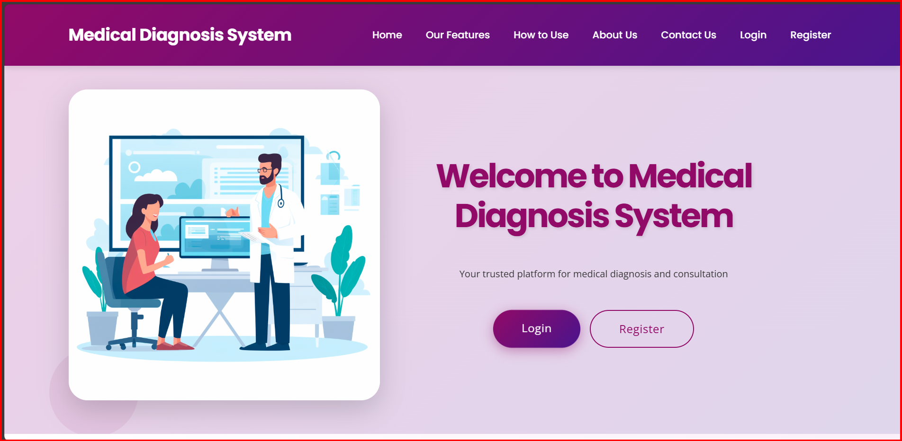
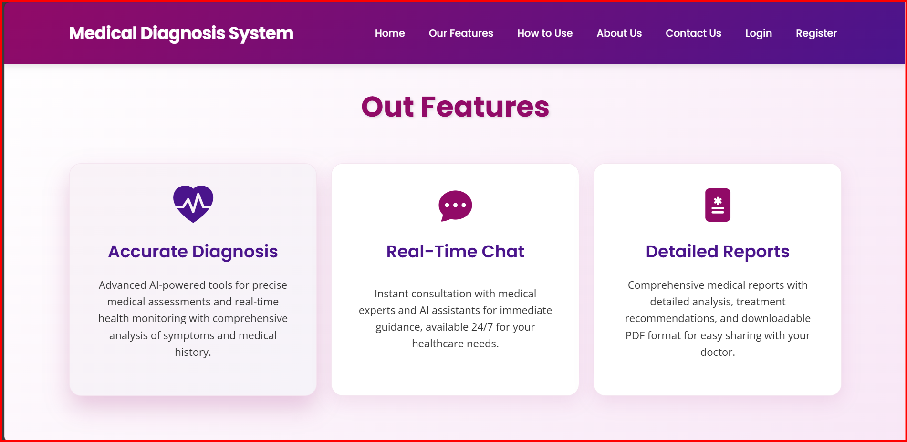
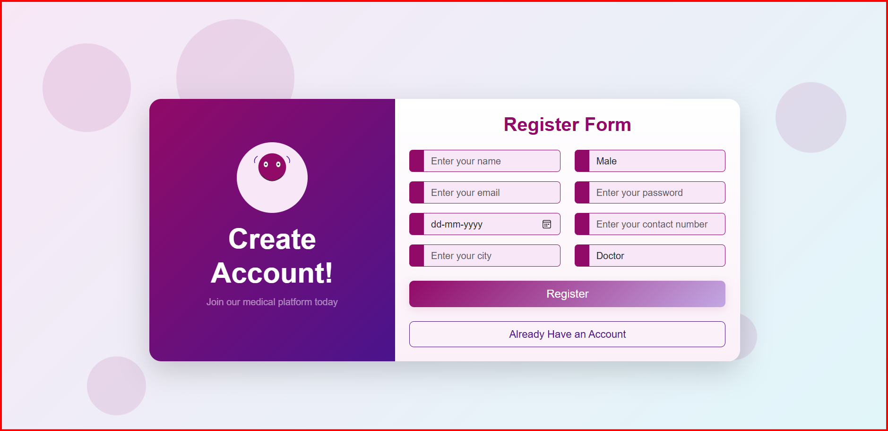
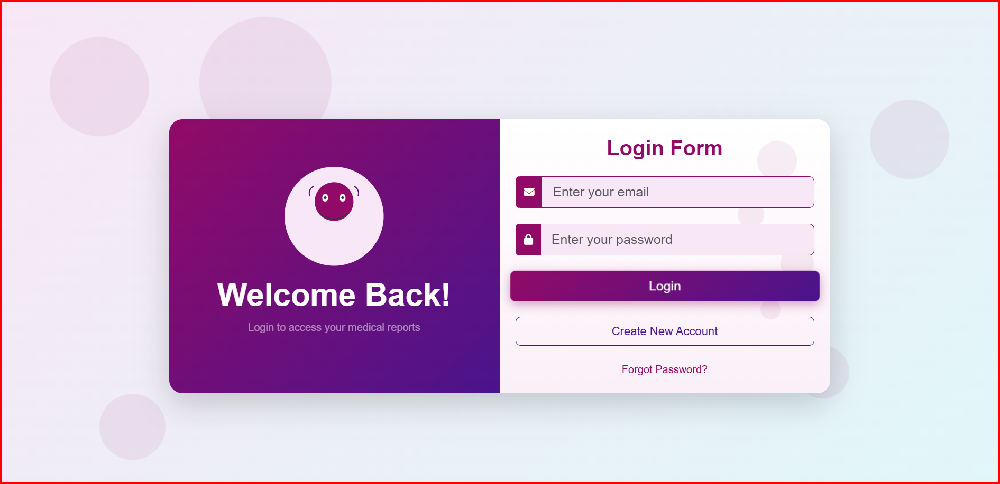
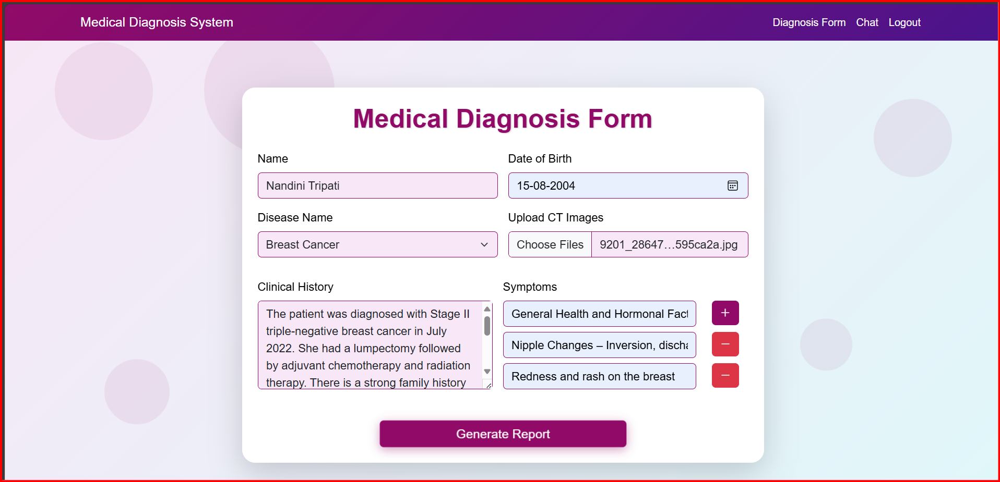
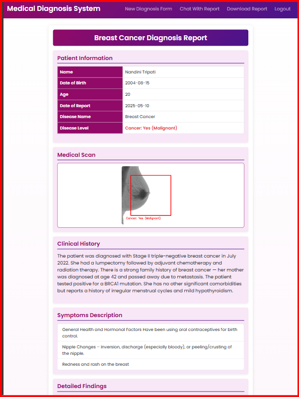
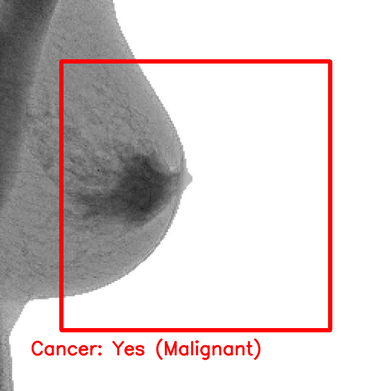
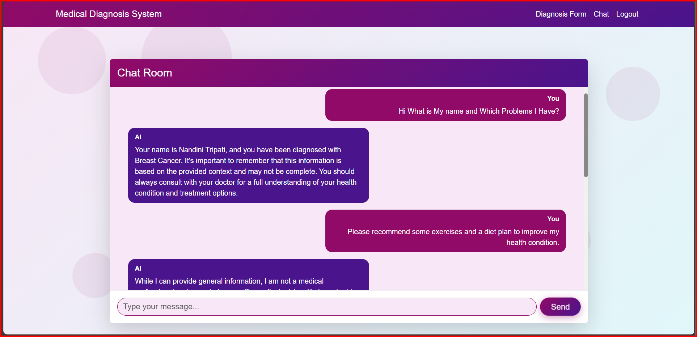

# 🏥 आरोग्यनिदानम्: Intelligent Medical Report Generator and Assistant

> Empowering Healthcare through AI — Automated Diagnosis, Detailed Reports & Personalized Assistance 💡

---

## 📌 Overview

**आरोग्यनिदानम्** (Ārogyanidānam) is a **full-stack AI-powered medical assistant and report generator** that assists doctors and patients in diagnosing diseases, analyzing CT scan images, and creating structured reports with AI-driven recommendations.

🚀 Built using **Flask**, **TensorFlow**, **LangChain**, and **FAISS**, the system includes patient management, disease prediction, chat-based medical support, and downloadable PDF reports.

---

## 🧠 Core Features

✨ **Patient Management System** – Register, login & securely store health data  
🧾 **Medical Report Generation** – Based on symptoms, clinical history & uploaded images  
📷 **CT Scan Image Analysis** – AI-powered prediction using trained deep learning model  
📊 **Pathological Staging** – Integrated AI for diagnosis details and staging  
💬 **Chatbot Assistance** – Ask questions to the AI using LangChain & Groq API  
🥗 **Health Guidance** – Diet, exercise, and precaution suggestions  
📥 **PDF Export** – Professionally formatted report downloads for consultation  
🌐 **RAG-enabled Search** – Contextual retrieval from stored data and generated report using FAISS  

---

## 🗂️ Folder Structure

```
आरोग्यनिदानम्/
├── Modal/
│   ├── Accuracy Matrix.png
│   ├── Breast_Cancer.ipynb
│   ├── breast_cancer.keras
│   ├── Training vs val.png
│   └── Dataset/
│       ├── test/
│       ├── train/
│       └── valid/
├── screenshots/              # 📸 Project UI screenshots
│   ├── Home1.png
│   ├── Home2.png
│   ├── Register.png
│   ├── Login.png
│   ├── Patients_Form.png
│   ├── Report.png
│   ├── Chat.png
│   └── Output.png
├── static/
│   ├── assets/
│   └── uploads/
├── templates/
│   ├── base.html
│   ├── chat.html
│   ├── form.html
│   ├── home.html
│   ├── login.html
│   ├── register.html
│   └── report.html
├── main.py                    # Flask application logic
├── requirements.txt           # Python dependencies
├── LICENSE                    # MIT License
└── README.md                  # Project Documentation
```

---

## 🛠️ Tech Stack

| Layer        | Technology                  |
|--------------|------------------------------|
| Backend      | Flask, SQLAlchemy, bcrypt     |
| Frontend     | HTML5, Bootstrap 5            |
| AI/ML        | TensorFlow, Keras, OpenCV     |
| NLP & Chat   | LangChain, Groq API, FAISS    |
| Storage      | SQLite                        |
| PDF Reports  | reportlab                     |

---

## ✅ Prerequisites

- Python 3.10+ 🐍  
- Flask Framework 🌐  
- TensorFlow 2.x 🧠  
- FAISS for vector search 📚  
- LangChain for RAG & context chat 🤖  

---

## 🔧 Installation & Setup

1. **Clone the Repository**

```bash
git clone https://github.com/VanshGosavi07/Mini-Project-2.git
cd Mini-Project-2
```

2. **Install Dependencies**

```bash
pip install -r requirements.txt
```

3. **Set Environment Variables**

```bash
set SECRET_KEY=your-secret-key
set GROQ_API_KEY=your-groq-api-key
```

🔐 [Get your Groq API Key here](https://console.groq.com/home)

4. **Run the Application**

```bash
python main.py
```

🌍 Open [http://localhost:5000](http://localhost:5000) in your browser.

---

## 📘 How to Use

1️⃣ **Register/Login** – Create your account securely  
2️⃣ **Fill Patient Info** – Enter name, age, symptoms, upload CT image  
3️⃣ **Generate Report** – AI analyzes image + text and builds full report  
4️⃣ **Interact via Chat** – Ask questions about the report using the AI bot  
5️⃣ **Download PDF** – Export report in professional format for consultation

---

## 📸 Screenshots

### 🏠 Home Page – Welcome Interface  
  


---

### 🔐 Register & Login Pages  
  


---

### 📝 Patient Form  


---

### 📄 Report Generation Output  
  


---

### 💬 Chat Assistant  


---

## 🤝 Contribution Guidelines

We welcome your ideas, fixes, and features!

```bash
# Fork and Clone the repository
git checkout -b feature-branch
git commit -m "✨ Add new feature"
git push origin feature-branch
```

Open a **pull request** and let us know what you added 🔧

---

## 📜 License

This project is licensed under the [MIT License](./LICENSE).  
Free to use, modify, and distribute.

---

## 📬 Contact & Support

- GitHub: [@VanshGosavi07](https://github.com/VanshGosavi07)  
- Email: [vanshgosavi7@gmail.com](mailto:vanshgosavi7@gmail.com)  
- Phone: 📞 +91 9359775740  

---

🚀 **Build the Future of Digital Healthcare with आरोग्यनिदानम्!**  
🧑‍⚕️💻📊📥🧠💬📄
